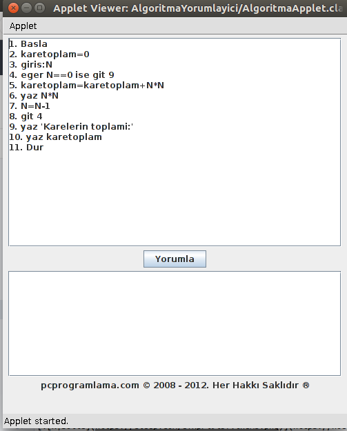

# Algoritma Yorumlayıcı
**!!! Uygulama kullanımından dolayı doğacak sorunlar sizin sorumluluğunuzdadır. !!!**
## Kurulum
Algoritma Yorumlayıcı uygulamasının çalışabilmesi için bilgisayarınızda [Java SE](http://www.oracle.com/technetwork/java/javase/downloads/index.html) kurulu olmalıdır.

- ### Git Kullanarak
```sh
git clone https://github.com/sevketcakir/algint4a.git
```
- ### Siteden İndirme
[Bağlantıya](https://github.com/sevketcakir/algint4a/archive/master.zip) tıklayarak sıkıştırılmış dosyayı indirebilirsiniz.
## Kullanım
Algoritma Yorumlayıcı içinde bir adet Java uygulaması ve Java Applet'i barındırır. Algoritmalar farklı şekillerde girdi olarak verilebilir:
- ### Komut satırı \(**stdin**\)
**Linux**: Uygulama klasöründe iken standart girişten(klavyeden) algoritmanızı yazıp Ctrl+D tuşuna basarak çalıştırabilirsiniz.
```sh
./alg.sh
```
**Windows**:
```
alg.bat
```
- ### Girdi dosyası
**Linux**:
```sh
./alg.sh < ornek1.alg
```
**Windows**:
```
alg.bat < ornek1.alg
```
- ### Applet
**Linux**:
```sh
./aap.sh
```
**Windows**:
```
aap.bat
```


## Örnek Algoritma
```
1. Basla
2. karetoplam=0
3. giris:N
4. eger N==0 ise git 9
5. karetoplam=karetoplam+N*N
6. yaz N*N
7. N=N-1
8. git 4
9. yaz 'Karelerin toplami:'
10. yaz karetoplam
11. Dur
```
